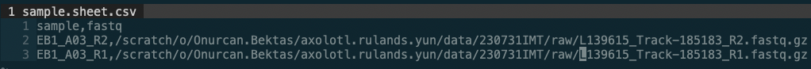
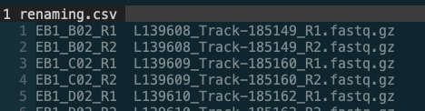
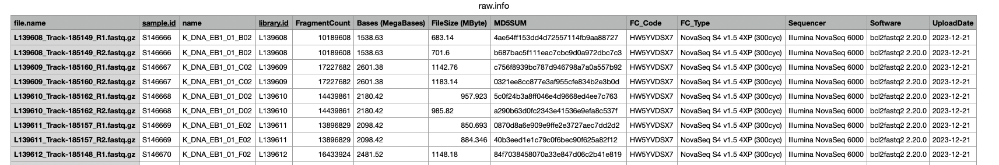

# scNMTseq pipeline (RNA + DNA)

The Nextflow pipelines are under `pipeline` directory.
The corresponding config files are under `config` directory.

Both scRNA and scDNA parts of the pipeline assume the following directory structure:

- data/ 
  - <dataset name>
    - raw/ (fastq, bam, and intermediatery cov files)
    - logs/ (logs generated during the pipeline)
    - metadata/ (all metadata, including rename.csv and sample.sheet.csv)
    - cooked/ (all data used for the post-processing, such as .NOMe.CpG.cov, and .complexity.csv)
    - results/
        - reports/ (all reports from the pipeline, this is where MULTIQC will find its reports)
        - figures/ (all figures generated in the post-processing)
- pipelines/ (all .nf files)
- config/ (all config files used by the .nf files)

## How to run

The DNA and the RNA pipelines can be run with

```{bash}
dataset=230731IMT;
nextflow -log data/${dataset}/logs/nextflow.log run ./pipelines/scnmtseq.dna.nf -c config/scnmtseq.dna.config -profile kcs -N onurcan.bektas@lmu.de --dataset_name ${dataset} -resume
```

```{bash}
dataset=230731ITR;
nextflow -log data/${dataset}/logs/nextflow.log run ./pipelines/scnmtseq.rna.nf -N onurcan.bektas@lmu.de --dataset_name ${dataset} -resume
```

The `multiqc` process in the DNA pipeline might not work. In that case you can run the MULTIQC manually with 

```{bash}
 dataset=230731IMT;
 multiqc --outdir data/${dataset}/results/reports/ --filename ${dataset} --verbose --force data/${dataset}/results/reports/ -c config/multiqc_config.yaml  --interactive --sample-names data/${dataset}/metadata/renaming.csv
```

## Before running the pipeline


1. Change the `temp` and `cache` directories inside the `config/scnmtseq.dna.config` (and other config files) according to your server's temp folders.
2. Change the resource settings (e.g. memory, cpus, etc.) for SLURM inside `config/base.config` according resources of your cluster
3. Create `sample.sheet.csv` and `renaming.csv` for the dataset on which you want to run the pipeline (see more on this below).


## How to create the sample.sheet.csv and renaming.csv

Here are the typical contents of these files:




`sample.sheet.csv` is used to feed fastq files into the DNA pipeline, and `renaming.csv` file is used to rename the fastq files in MULTIQC.


```{r}
pacman::p_load(R.utils, data.table, here, stringr, testit, dplyr)
dataset_name = "230731IMT"

## raw.info.csv is the .xlsx file that we get from genomecenter alongside fastq files
raw.info <- fread(here::here(paste0("data/", dataset_name, "/metadata/raw.info.csv")))
gex <- raw.info 
setDT(gex)
gex[, r := str_extract(file.name, pattern = "R[1-3]{1}(?=.fastq.gz)")]
gex <- gex[, .(name, file.name, r)]

## remove unnecessary extension to the sample name
gex[, `:=`(sample = paste(gsub(pattern = "^K_DNA_", replacement = "", gsub(pattern = "_[0-9]{2}", replacement = "", name)), r, sep = "_"), 
           fastq = here::here(paste0("data/", dataset_name, "/raw/", file.name)))]

gex.ret <- gex[file.exists(fastq)][, .(sample, fastq)]
fwrite(gex.ret, here::here(paste0("data/", dataset_name, "/metadata/sample.sheet.csv")))
fwrite(gex[, .(sample, file.name)], here::here(paste0("data/", dataset_name, "/metadata/renaming.csv")), sep = "\t", col.names = F)

```

here is a typical `raw.info.csv` file:



## Disclaimer

The general structure of the RNA and DNA pipelines are similar, though the RNA pipeline hasn't been updated for a while, so there might be some idiosyncrasies between them, in terms of file name conventions.

Inside `pipelines/genome.nf`, there are process with which you can generate index files from the genome for kallisto and bismark, seperately.

# Contact

Onurcan Bektas: onurcan.bektas@lmu.de

